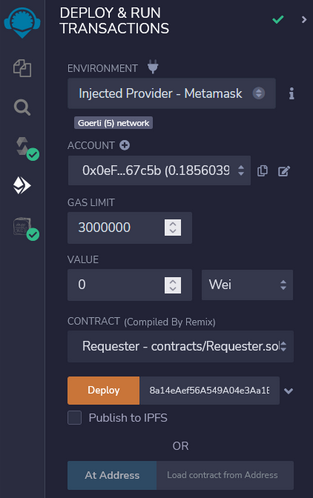
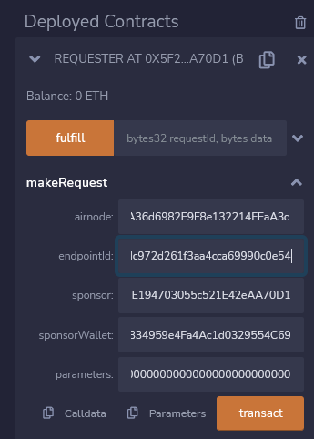

<PageHeader/>

# {{$frontmatter.title}}

> <Video src="https://www.youtube.com/embed/Hss-8Tzg7TI"/>

::: warning TODO

- Review and fix the wording
- Review Code Snippets and comments
- `requestId` bit is unclear. Need to fix that

:::

## Introduction

[Airnodes](/reference/airnode/latest/concepts/airnode.html) are first-party
oracles that are directly operated by the API Providers that provide data to any
on-chain dApp. The Smart Contracts can request data from the Airnodes without
going through any intermediary.

This guide shows you how to code, deploy, and run a simple smart contract that
requests data from an Airnode.

## Coding the Requester Contract

::: warning Check your Network!

Make sure you're on a Testnet before trying to deploy the contracts on-chain!

:::

This is an example of a basic
[Requester Contract](/reference/airnode/latest/concepts/requester.html) to
request data from any Airnode. You can open the following contract in Remix and
try deploying your own Requester Contract.

[Open in Remix](https://remix.ethereum.org/#url=https://github.com/vanshwassan/RemixContracts/blob/master/contracts/Requester.sol&optimize=false&runs=200&evmVersion=null&version=soljson-v0.8.9+commit.e5eed63a.js)

```solidity
// SPDX-License-Identifier: MIT
pragma solidity 0.8.9;
// [!code focus:2]
import "@api3/airnode-protocol/contracts/rrp/requesters/RrpRequesterV0.sol";

// A Requester that will return the requested data by calling the specified airnode.

contract Requester is RrpRequesterV0 {
    mapping(bytes32 => bool) public incomingFulfillments;
    mapping(bytes32 => int256) public fulfilledData;

    // Make sure you specify the right _rrpAddress for your chain while deploying the contract.
    constructor(address _rrpAddress) RrpRequesterV0(_rrpAddress) {}
// [!code focus:18]
    function makeRequest(
        address airnode,
        bytes32 endpointId,
        address sponsor,
        address sponsorWallet,
        bytes calldata parameters

    ) external {
        bytes32 requestId = airnodeRrp.makeFullRequest(
            airnode,                        // airnode
            endpointId,                     // endpointId
            sponsor,                        // sponsor's address
            sponsorWallet,                  // sponsorWallet
            address(this),                  // fulfillAddress
            this.fulfill.selector,          // fulfillFunctionId
            parameters                      // encoded API parameters
        );
        incomingFulfillments[requestId] = true;
    }

    // The callback function with the requested data
    // [!code focus:4]
    function fulfill(bytes32 requestId, bytes calldata data)
        external
        onlyAirnodeRrp
    {
        require(incomingFulfillments[requestId], "No such request made");
        delete incomingFulfillments[requestId];
        int256 decodedData = abi.decode(data, (int256));
        // [!code focus:2]
        fulfilledData[requestId] = decodedData;
    }
}
```

### Request Parameters

A full request using the AirnodeRrpV0.sol contract `makeFullRequest` function
requires all parameters needed by the Airnode application to be passed at
runtime.

Since the `makeRequest` function makes a
[full request](/reference/airnode/latest/concepts/request.html#full-request), it
must gather the following parameters to pass on to `airnodeRrp.makeFullRequest`.

- `airnode` and `endpointId`: As a pair, these uniquely identify the endpoint
  desired at a particular Airnode.

- `sponsor`: The [sponsor](/reference/airnode/latest/concepts/sponsor.html)
  address.

- `sponsorWallet`: The
  [sponsor wallet](/reference/airnode/latest/concepts/sponsor.html#sponsorwallet)
  address that the sponsor received when deriving the wallet for the Airnode
  being called.

- `fulfillAddress` and `fulfillFunctionId`: The public address of your requester
  contract and its function that is called upon the return of the request.

- `parameters`: Specify the API parameters and any
  [reserved parameters](/reference/ois/latest/reserved-parameters.html), these
  must be encoded. See
  [Airnode ABI specifications](/reference/airnode/latest/specifications/airnode-abi.html)
  for how these are encoded. In most, cases the `parameters` are encoded
  off-chain and passed to the requester which only forwards them. You can use
  the
  [@api3/airnode-abi](/reference/specifications/airnode-abi-specifications.html#api3-airnode-abi)
  package to perform the encoding and decoding.

### Response Parameters

The callback to a requester contains two parameters, as shown in the `fulfill`
function in the code sample above.

- `requestId`: First acquired when making the request and passed here as a
  reference to identify the request for which the response is intended.
- `data`: In case of a successful response, this is the requested data which has
  been encoded and contains a timestamp in addition to other response data.
  Decode it using the function decode() from the abi object.

## Deploying and Sponsoring the Requester

:::warning Set up your Testnet Metamask Account!

Make sure you've already configured your Metamask wallet and funded it with some
testnet ETH before moving forward. You can request some from
[here](https://faucet.paradigm.xyz/)

:::

We'll now deploy the Requester Contract and call it through Remix. We'll be
calling the [Coingecko Airnode]() to request the latest price of Ethereum.

### Compile and Deploy the Requester Contract on Goerli Testnet

- [Click here](https://remix.ethereum.org/#url=https://github.com/vanshwassan/RemixContracts/blob/master/contracts/Requester.sol&optimize=false&runs=200&evmVersion=null&version=soljson-v0.8.9+commit.e5eed63a.js)
  to open the Requester Contract in Remix.

> 

- Click compile on the right side of the dashboard and compile the Smart
  Contract.

> 

- Head to Deploy and run Transactions and select Injected Provider — MetaMask
  option under Environment. Connect your MetaMask. Make sure you’re on the
  Goerli Testnet.

- The `_rrpAddress` is the main `airnodeRrpAddress`. The RRP Contracts have
  already been deployed on-chain. You can check for your specific chain
  [here](https://docs.api3.org/airnode/reference/airnode-addresses.html). Fill
  it in and Deploy the Contract.

> 

### Sponsor the Requester

The
[Sponsor Wallet](/reference/airnode/latest/concepts/sponsor.html#sponsorwallet)
needs to be derived from the requester's contract address, the Airnode address,
and the Airnode xpub. The wallet is used to pay gas costs of the transactions.
The sponsor wallet must be derived using the command
[derive-sponsor-wallet-address](/reference/airnode/latest/concepts/sponsor.html#derive-a-sponsor-wallet)
from the Admin CLI. Use the value of the sponsor wallet address that the command
outputs while making the request. **This wallet needs to be funded.**

::: details Coingecko's Airnode Details

```
Coingecko's Airnode Address = 0x09c623940ad5729A36d6982E9F8e132214FEaA3d
Coingecko's Airnode XPUB = xpub6CeoWe3yV6yiewhdpfXDcj4JURNar7yuD95AtS6eba18z6aZaXzKKrVH9bNb8nMDptUA4vcAEr6HoYEMCpNwsGCeVqQhvXsHLJheVF8K6VM
Coingecko's Endpoint ID (`/simple/price`) = 0x484d51e779e2e2fe0ee39b5fb676f4bddd237dc972d261f3aa4cca69990c0e54
```

:::

```sh
npx @api3/airnode-admin derive-sponsor-wallet-address \
  --airnode-xpub xpub6CeoWe3yV6yiewhdpfXDcj4JURNar7yuD95AtS6eba18z6aZaXzKKrVH9bNb8nMDptUA4vcAEr6HoYEMCpNwsGCeVqQhvXsHLJheVF8K6VM \
  --airnode-address 0x09c623940ad5729A36d6982E9F8e132214FEaA3d \
  --sponsor-address <Use the address of your Deployed Requester>

  Sponsor wallet address: 0x6394...5906757
  # Use the above address from your command execution as the value for sponsorWallet.
```

::: warning Designated Sponsor Wallets

Sponsors should not fund a `sponsorWallet` with more then they can trust the
Airnode with, as the Airnode controls the private key to the `sponsorWallet`.
The deployer of such Airnode undertakes no custody obligations, and the risk of
loss or misuse of any excess funds sent to the `sponsorWallet` remains with the
sponsor.

:::

### Encoding parameters

`parameters` specify the API and Reserved Parameters (see
[Airnode ABI specifications]() for how these are encoded). The parameters are
required to be encoded in bytes32 before you send it. We are going to use the
[@airnode-abi]() library for encoding the parameters off-chain and then sending
it to the Requester.

You can encode your API Parameters off-chain using the following code snippet.

```js
const { encode } = require('@api3/airnode-abi');
const { decode } = require('@api3/airnode-abi');

// Add your parameters here, then copy the encoded data to be used as parameters in the makeRequest function.
const params = [
  { type: 'string', name: 'vs_currencies', value: 'usd' },
  { type: 'string', name: 'ids', value: 'bitcoin' },
  { type: 'string', name: '_path', value: 'bitcoin.usd' },
  { type: 'string', name: '_type', value: 'int256' },
];

const encodedData = encode(params);
const decodedData = decode(encodedData);

console.log(encodedData);
console.log(decodedData);
```

## Making the Request

Head to Deploy & run transactions and click on the dropdown for your Requester
under Deployed Contracts.

Now select the `makeRequest` dropdown to see all the parameters you need to pass
in order to make a full request to the Airnode. Populate all the fields and
click on Transact.

> 

Head over to [Goerli Testnet Explorer](https://goerli.etherscan.io/) and check
your `sponsorWallet` for any new transactions.

> 

Here, we can see the latest `Fulfill` transaction.

::: tip You might need to wait for a minute or two

The Airnode calls the fulfill() function in `AirnodeRrpV0.sol` that will in turn
call back the requester contract at `fulfillAddress` using function
`fulfillFunctionId` to deliver data.

:::

Now go back on Remix and check for `requestId` under logs for the latest
transaction.

Copy your `requestId` and paste it under the `fulfilledData` method to decode
the response. Click on call and you will see the API response. Here, you can see
your requested data decoded in `int256`

> 
