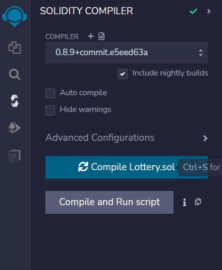
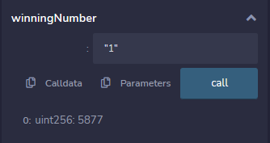

<PageHeader/>

# {{$frontmatter.title}}

::: warning

Fix the introduction part

:::

## Introduction

In this tutorial we’ll be walking through building and deploying a decentralized
lottery smart contract in Solidity using Remix to demonstrate the use of QRNG in
your smart contracts.

Anyone can choose a number 1–10,000 and buy a ticket to enter into a weekly
lottery. The ticket revenue is collected into a pot in the contract. After 7
days, the contract will allow anyone to trigger the drawing.

The contract will then call the API3 QRNG for a truly random number generated by
quantum mechanics. The pot will be split amongst all users that chose this
winning number. If there are no winners, the pot will be rolled over to the next
week. Once deployed, the lottery will continue to run and operate itself
automatically without any controlling parties!

We'll be using the
[Airnode Request-Response Protocol (RRP)](https://docs.api3.org/airnode/v0.7/concepts/)
to get the random numbers onto the blockchain for the lottery. API3 QRNG is an
Airnode
[first-party oracle](https://docs.api3.org/api3/introduction/first-party-oracles.html)
serving these random numbers from the Australian National University for
blockchain and Web3 use-cases. Check our
[API3 docs](https://docs.api3.org/api3/) to learn more about API3 and get an
[overview of Airnode](https://docs.api3.org/airnode/v0.7/).

## Writing the Smart Contract

::: warning Check your Network!

Make sure you're on a Testnet before trying to deploy the contracts on-chain!

:::

> The complete contract code can be found
> [here](https://github.com/camronh/Lottery-Tutorial/blob/main/contracts/Lottery.sol)

[Open in Remix](https://remix.ethereum.org/#url=https://raw.githubusercontent.com/camronh/Lottery-Tutorial/main/contracts/Lottery.sol&optimize=false&runs=200&evmVersion=null&version=soljson-v0.8.9+commit.e5eed63a.js)

As a requester, our `Lottery.sol` contract will make requests to an Airnode,
specifically the API3 QRNG, using the
[Request-Response Protocol (RRP)](https://docs.api3.org/airnode/v0.7/concepts/).
It may be helpful to take a little time familiarize yourself if you haven't
already.

Set the solidity version, and import the
[Airnode Protocol](https://docs.api3.org/airnode/v0.7/concepts/) into contract

```solidity
// SPDX-License-Identifier: UNLICENSED
pragma solidity ^0.8.9;

import "@api3/airnode-protocol/contracts/rrp/requesters/RrpRequesterV0.sol";

contract Lottery is RrpRequesterV0{
```

Add global variables to the contract

```Solidity
contract Lottery is RrpRequesterV0, Ownable {
    // Events
    event RequestedRandomNumber(bytes32 indexed requestId);
    event ReceivedRandomNumber(bytes32 indexed requestId, uint256 randomNumber);

    // Global Variables
    uint256 public pot = 0; // total amount of ether in the pot
    uint256 public ticketPrice = 0.0001 ether; // price of a single ticket
    uint256 public week = 1; // current week counter
    uint256 public endTime; // datetime that current week ends and lottery is closable
    uint256 public constant MAX_NUMBER = 10000; // highest possible number
    address public constant airnodeAddress = 0x9d3C147cA16DB954873A498e0af5852AB39139f2;
    bytes32 public constant endpointId = 0xfb6d017bb87991b7495f563db3c8cf59ff87b09781947bb1e417006ad7f55a78;
    address payable public sponsorWallet;
```

Underneath the global variables, add our
[error handling](https://docs.soliditylang.org/en/v0.8.16/contracts.html#errors-and-the-revert-statement)

```Solidity
error EndTimeReached(uint256 lotteryEndTime);
```

Underneath the errors, add the mappings for tickets and winning numbers

```solidity
mapping(uint256 => mapping(uint256 => address[])) public tickets; // mapping of week => entry number choice => list of addresses that bought that entry number
mapping(uint256 => uint256) public winningNumber; // mapping to store each weeks winning number
mapping(bytes32 => bool) public pendingRequestIds; // mapping to store pending request ids
```

Underneath the mappings, add the constructor function that will take the
`_airnodeRrpAddress`

When deploying the contract, we'll need to pass in a datetime that the lottery
will end. After the lottery ends, the next week will begin and will end 7 days
after the original `endTime`.

```Solidity
    /// @notice Initialize the contract with a set day and time of the week winners can be chosen
    /// @param _endTime Unix time when the lottery becomes closable
    constructor(uint256 _endTime, address _airnodeRrpAddress)
        RrpRequesterV0(_airnodeRrpAddress)
    {
        if (_endTime <= block.timestamp) revert EndTimeReached(_endTime);
        endTime = _endTime; // store the end time of the lottery
    }
```

Add a function to set the Sponsor Wallet

```Solidity
    function setSponsorWallet(address payable _sponsorWallet)
        external
        onlyOwner
    {
        sponsorWallet = _sponsorWallet;
    }
```

Underneath the constructor function, add a function to buy a ticket

```solidity
function enter(uint256 _number) external payable {
    require(_number <= MAX_NUMBER, "Number must be 1-MAX_NUMBER"); // guess has to be between 1 and MAX_NUMBER
    if (block.timestamp >= endTime) revert EndTimeReached(endTime); // lottery has to be open
    require(msg.value == ticketPrice, "Ticket price is 0.0001 ether"); // user needs to send 0.0001 ether with the transaction
    tickets[week][_number].push(msg.sender); // add user's address to list of entries for their number under the current week
    pot += ticketPrice; // account for the ticket sale in the pot
}
```

Users can call this function with a number 1-10000 and a value of 0.001 ether to
buy a lottery ticket. The user's address is added to the addresses array in the
`tickets` mapping.

In the `Lottery.sol` contract, add the following function to make the request
for randomness.

```Solidity
function getWinningNumber() external payable {
  // require(block.timestamp > endTime, "Lottery has not ended"); // not available until end time has passed
  require(msg.value >= 0.01 ether, "Please top up sponsor wallet"); // user needs to send 0.01 ether with the transaction
  bytes32 requestId = airnodeRrp.makeFullRequest(
      airnodeAddress,
      endpointId,
      address(this), // Use the contract address as the sponsor. This will allow us to skip the step of sponsoring the requester
      sponsorWallet,
      address(this), // Return the response to this contract
      this.closeWeek.selector, // Call this function with the response
      "" // No params
  );
  pendingRequestIds[requestId] = true; // Store the request id in the pending request mapping
  emit RequestedRandomNumber(requestId); // Emit an event that the request has been made
  sponsorWallet.call{value: msg.value}(""); // Send funds to sponsor wallet
}
```

**We'll now make a function to pick the winners using QRNG**

- In the first line, we set the function to take in the `requestID` and the
  payload.
- In line 3, we add a modifier to restrict this function to only be accessible
  by Airnode RRP.
- On line 5 and 6, we handle the `requestID`. If the `requestID` is not in the
  `pendingRequestIds` mapping, we throw an error, otherwise we delete the
  request ID from the `pendingRequestIds` mapping.

- In line 8, we decode and typecast the random number from the payload. We don't
  need to import anything to use `abi.decode()`. Then we use the modulo operator
  (%) to ensure that the random number is between 0 and the max number.

- Line 11 will prevent duplicate requests from being fulfilled. If more than 1
  request is made, the first one to be fulfilled will increment the endTime and
  the rest will revert. We will leave it commented out for now.

```solidity
    function closeWeek(bytes32 requestId, bytes calldata data)
        external
        onlyAirnodeRrp
    {
        require(pendingRequestIds[requestId], "No such request made");
        delete pendingRequestIds[requestId]; // remove request id from pending request ids

        uint256 _randomNumber = abi.decode(data, (uint256)) % MAX_NUMBER; // get the random number from the data
        emit ReceivedRandomNumber(requestId, _randomNumber); // emit the random number as an event

        // require(block.timestamp > endTime, "Lottery is open"); // will prevent duplicate closings. If someone closed it first it will increment the end time and not allow

        winningNumber[week] = _randomNumber;
        address[] memory winners = tickets[week][_randomNumber]; // get list of addresses that chose the random number this week
        unchecked {
            ++week; // increment week counter, will not overflow on human timelines
        }
        endTime += 7 days; // set end time for 7 days later
        if (winners.length > 0) {
            uint256 earnings = pot / winners.length; // divide pot evenly among winners
            pot = 0; // reset pot
            for (uint256 i = 0; i < winners.length; ) {
                payable(winners[i]).call{value: earnings}(""); // send earnings to each winner
                unchecked {
                    ++i;
                }
            }
        }

```

We'll now create a read only function

This function will return the list of addresses that chose the given number for
the given week.

```Solidity
function getEntriesForNumber(uint256 _number, uint256 _week) public view returns (address[] memory) {
    return tickets[_week][_number];
}
```

Create `receive` function

The
[receive function](https://docs.soliditylang.org/en/v0.8.14/contracts.html#receive-ether-function)
will be called if funds are sent to the contract. In this case, we need to add
these funds to the pot.

```Solidity
receive() external payable {
    pot += msg.value; // add funds to the pot
}
```

## Deploying the Contract

:::warning Set up your Testnet Metamask Account!

Make sure you've already configured your Metamask wallet and funded it with some
testnet ETH before moving forward. You can request some from
[here](https://faucet.paradigm.xyz/)

:::

We'll now deploy the Lottery Contract and call it through Remix. We'll be
calling the [QRNG Airnode]() to request a random number.

### Compile and Deploy the Lottery Contract on Goerli Testnet

- [Click here](https://remix.ethereum.org/#url=https://github.com/vanshwassan/RemixContracts/blob/master/contracts/Requester.sol&optimize=false&runs=200&evmVersion=null&version=soljson-v0.8.9+commit.e5eed63a.js)
  to open the Requester Contract in Remix.

> 

- Click compile on the right side of the dashboard and compile the Smart
  Contract.

> 

- Head to Deploy and run Transactions and select Injected Provider — MetaMask
  option under Environment. Connect your MetaMask. Make sure you’re on the
  Goerli Testnet.

- The `endTime` will be the ending time of the lottery. To have it end on the
  next week, execute this following code snippet. Use its output for `_ENDTIME`

  ```js
  console.log((nextWeek = Math.floor(Date.now() / 1000) + 9000));
  ```

- The `_AirnodeRrpAddress` is the main `airnodeRrpAddress`. The RRP Contracts
  have already been deployed on-chain. You can check for your specific chain
  [here](https://docs.api3.org/airnode/reference/airnode-addresses.html). Fill
  it in and Deploy the Contract.

> 

## Deriving the Sponsor Wallet

The
[Sponsor Wallet](/reference/airnode/latest/concepts/sponsor.html#sponsorwallet)
needs to be derived from the requester's contract address, the Airnode address,
and the Airnode xpub. The wallet is used to pay gas costs of the transactions.
The sponsor wallet must be derived using the command
[derive-sponsor-wallet-address](/reference/airnode/latest/concepts/sponsor.html#derive-a-sponsor-wallet)
from the Admin CLI. Use the value of the sponsor wallet address that the command
outputs while making the request. **This wallet needs to be funded.**

::: details QRNG Airnode Details

```
QRNG Airnode Address = 0x9d3C147cA16DB954873A498e0af5852AB39139f2
QRNG Airnode XPUB = xpub6DXSDTZBd4aPVXnv6Q3SmnGUweFv6j24SK77W4qrSFuhGgi666awUiXakjXruUSCDQhhctVG7AQt67gMdaRAsDnDXv23bBRKsMWvRzo6kbf
```

:::

```sh
npx @api3/airnode-admin derive-sponsor-wallet-address \
  --airnode-xpub xpub6DXSDTZBd4aPVXnv6Q3SmnGUweFv6j24SK77W4qrSFuhGgi666awUiXakjXruUSCDQhhctVG7AQt67gMdaRAsDnDXv23bBRKsMWvRzo6kbf \
  --airnode-address 0x9d3C147cA16DB954873A498e0af5852AB39139f2 \
  --sponsor-address <Use the address of your Deployed Lottery Contract>

  Sponsor wallet address: 0x6394...5906757
  # Use the above address from your command execution as the value for sponsorWallet.
```

Click on the `setSponsorWallet` button to and enter your Sponsor Wallet Address
to set it on-chain.

> 

::: warning Designated Sponsor Wallets

Sponsors should not fund a `sponsorWallet` with more then they can trust the
Airnode with, as the Airnode controls the private key to the `sponsorWallet`.
The deployer of such Airnode undertakes no custody obligations, and the risk of
loss or misuse of any excess funds sent to the `sponsorWallet` remains with the
sponsor.

:::

## Making the Bet

To make a bet on-chain, we've defined a minimum ticket price that the user will
have to pay to make a bet (0.0001 ETH). Under Deployed Contracts, select the
`enter` function and enter your number. You will also need to send in the ticket
price along with the bet. Head over to the top and enter the `ticketPrice` under
value and click on transact.

> 

> 

You can also check the Ticket Price by running the `ticketPrice` function.

> 

Next, we need a way for people to call Airnode for a random number when the
lottery is closed. We will call the `getWinningNumber` function in our contract
to make a random number request. This function emits an event that we can listen
to for our `requestID` that we will use to listen for a response. This function
will also fund the sponsor wallet.

Enter the amount to fund the sponsor wallet (0.01 ETH) and call
`getWinningNumber`

> 

> 

Head over to [Goerli Testnet Explorer](https://goerli.etherscan.io/) and check
your `sponsorWallet` for any new transactions.

> 

Here, we can see the latest `Fulfill` transaction.

::: tip You might need to wait for a minute or two

The Airnode calls the fulfill() function in `AirnodeRrpV0.sol` that will in turn
call back the requester contract at `fulfillAddress` using function
`fulfillFunctionId` to deliver data.

:::

You can check the winning number by calling the `winningNumber` function. Pass
in the week to check which number won.

> 
